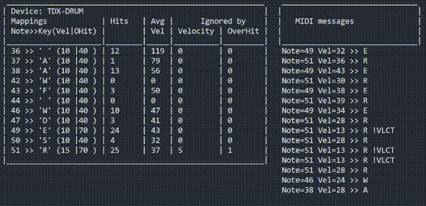

# MapperHero
A MIDI remapping tool for CloneHero game.

## Why
The newer Clone Hero MIDI mapping feature works pretty well, but I still missed some features that could improve *my* drumming experience, especially because I'm not using a mainstream E-drum from brands like Yamaha or Roland.

## Missing features in CloneHero MIDI mapping system
* Assign multiple MIDI notes to a single in-game action/button¹.
* Assign more than one MIDI device in a single profile².
* Get statistics from Velocity and Overhit thresholds, such as:
  - Number of notes ignored by each threshold  
  - Mean velocity values for each trigger
  - Other diagnostic metrics useful for calibration³

## Workaround: MapperHero
  
  
I created a simple remapping tool that provides these features. Currently, the tool performs MIDI→Keyboard remapping. **As Windows is getting some recent MIDI API significant updates, maybe I'll wait a bit and then implement it as a MIDI→MIDI remapper**, so dynamics stuff will be back.

## Use Cases
- Combine multiple MIDI notes into a single action
- Use multiple MIDI devices in one profile (Ex: Kit expansion using Arduino)
- Diagnose and filter the noisy triggers

## Download
Download the executable [here](https://github.com/marcusnizalvarez/MapperHero/releases/download/v0.1/MapperHero.zip).

- Tested on Windows 11 x64 25H2
- Compiled with GCC 13 (MinGW-w64)

## Notes
¹  I was getting a lot of missed notes on the *Snare* because the *Snare Ring* would sometimes trigger instead. Also, I wanted to make some experiments with the Hi-hat pedal that needed multiple remappings, like PedalPressed, OpenHiHat and ClosedHiHat notes.  
  
² I'm building more components for my E-drum, like double bass pedal  
  
³ I noticed that each Cymbal had different average velocities, and one of them produced lots of Overhit notes from vibration. Without metrics, I had to rely on guesswork and trial-and-error, so having statistics makes calibration much easier.  

## How to compile
```
x86_64-w64-mingw32-g++ MapperHero.cpp -o MapperHero.exe -static -lwinmm
```
